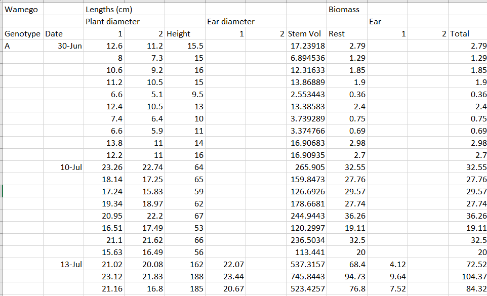
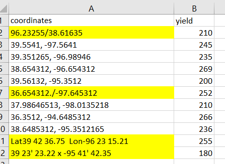
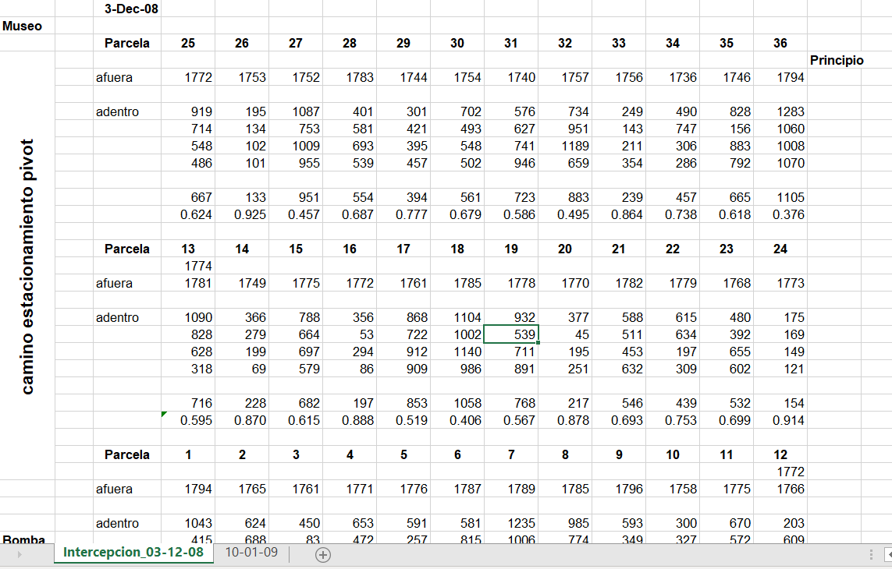

```{r setup, include=FALSE}
knitr::opts_chunk$set(echo = TRUE, message = F, warning = F)
library(tidyverse)
```

## Motivation  


### What is tidy data?  
All tidy data have the same structure:  

* Each variable has its own column.  
* Each observation must has own row.  
* Each value must hass own cell.  

> It allows R’s vectorised nature to shine. Remember the `mutate` and `summary` functions, most built-in R functions work with vectors of values.  

## Data Organization in Spreadsheets  
(paper [here](https://doi.org/10.1080/00031305.2017.1375989) )  
**Take-home messages:**  

* Be consistent  

* Choose good names   
  "weight" $\neq$ "weight` `", etc.  

* Dates as YYYY-MM-DD  

* No empty cells  
  For missing data, write "99" or "NA", etc.  

* Just one thing per cell  

* Create a data dictionary  

* Do not use font/cell color as data  

## Other resources  

* [Introduction to programming](https://ozanj.github.io/rclass/lectures/lecture1/lecture1.2.pdf)  

* [EDAV](https://edav.info/basics.html)  

# Kahoot  

# So... what do you do if you don't have tidy data?  

## Different (real-world) examples of untidy data  

## What' would you change's wrong?      
```{r untidy 1, out.width=950, echo=FALSE}

```

## What's wrong?  
```{r untidy 2, out.width=950, echo=FALSE}

```

## What would you change?  
```{r untidy 3, out.width=950, echo=FALSE}

```

## Pivot functions  

```{r lotus read}
lotus <- read.csv("../data/lotus.csv") %>% 
  dplyr::select(planta, trat, doy, starts_with("tallo_"))

#pivot_longer

#pivot_wider

```

## Use the pivot function for other visualizations  

```{r pivot viz}
lotus %>% 
  pivot_longer(cols = contains("tallo")) %>% 
  rename(tallo = value) %>% 
  dplyr::select(-name) %>% 
  pivot_longer(cols = -c(planta, trat, doy)) %>% 
  ggplot(aes(value))+
  geom_histogram()+
  facet_wrap(~name, scales ='free')
```


## Join functions     
Combine different datasets: e.g. yield with weather data  

```{r joins}
fao <- read.csv("../data/FAOSTAT_data_9-15-2021.csv")
fao_weather <- read.csv("../data/wb_weather.csv")

# inner_join

# left_join

# right join

# full_join

```

## Combine columns  

```{r unite}
# FAO site-year example  (Year - Area)

```

## Separate a column that contains more information  

```{r separate}
# lotus example

# coords example
read.csv("../data/coords.csv")

```

## Work in groups  

Read the file "Data file of Heat tolerance of chickpea genotypes in thermal zone of Ethiopia.xlsx" (also, check the metadata) and then:  
**a.** Create the columns:
* "FPI" that is the Flowering-Podding Interval (i.e. the difference (in days) between 50% flowering and 50% podding); "PD", Podding duration, as the difference (in days) between start and end of podding.  
**b.** Read the file "chickpea_weather_madeup.csv" and pair each treatment with its data and create a new dataframe containing all the information, but only with the treatments that have crop data.  
**c.** Create a new dataframe that is the "longer" version of that "wide" dataframe.  
**d.** Visualize Yield versus PD, and visualize the average temperature july-september.  

**Extra and super fun:** Pick 2 treatments of your choice and make a timeline with x = days, y = treatment, and in text show the event happening at which moment. 

## Discuss  
You are working on a model to predict yield using soil, weather and crop data. You want to try the following variables to your model:  
* Yield  
* Density  
* Genotype  
* N fertilization  
* P fertilization  
* Planting date  
* Soil water content  
* Sand %  
* Clay %  
* pH  

* Precipitation (induvidual for April, May, June, July, Sept and Oct)  
* Temperature (induvidual for April, May, June, July, Sept and Oct)  

How would you arrange your data frame?  

## Wrapup  

* Tidy data saves time and preserves your (and everyone else's) mental health  
